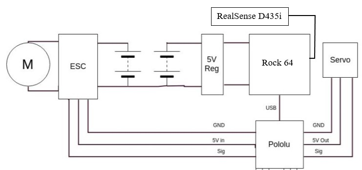
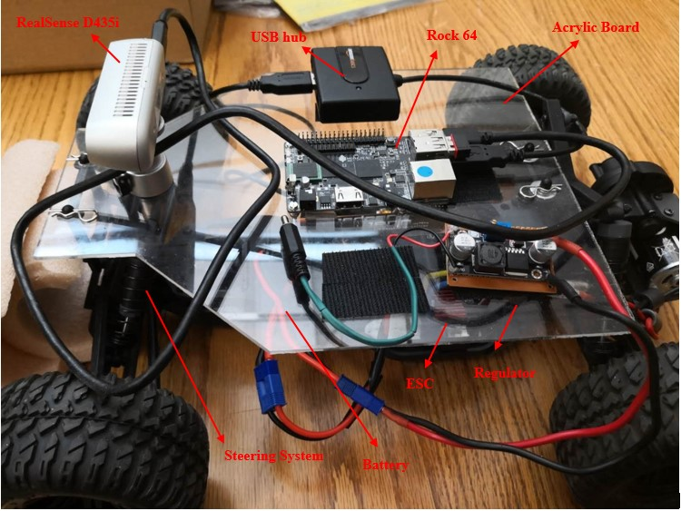
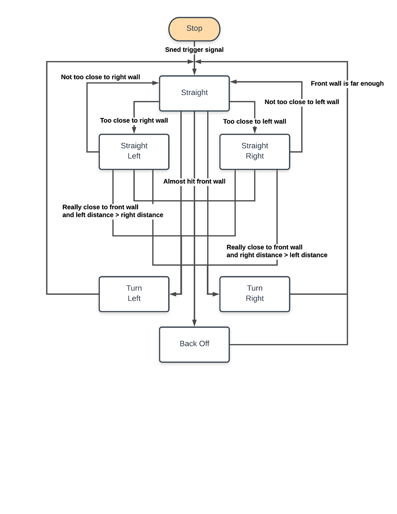
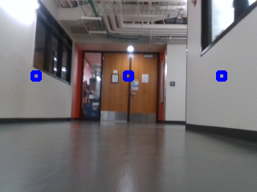
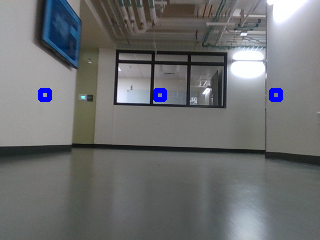

# Autocar
An 1/10 autocar project on Advance Robotics class with our team Robotgrandson.

Instructor: Prof. Christoffer Heckman.
Team Member: Chi-Ju Wu, Chi Chen, Zheng Shen, Dongming Chang, Zhengyu Hua.

## Goal:

Realize a self-driving race car which is capable of many different challenges and integrate the hardware and algorithms in perception, motion planning and trajectory generation. 

## Hardware design:

The hardware includes a RealSense camera, a Pololu controller, an on board IMU and a Rock 64 CPU. This system utilizes the depth data of RealSense camera to realize real-time obstacle detection and IMU data to track the status of the race car. We designs a two-stage shelf for all the devices, as the picture showed.

Layout of wiring of the race car

The outlook of the race car

## Software design:

To complete this final project, we adopt to develop our programs on ROS (Robotics Operating System). Because of the active community and the rich packages for controlling robots, ROS is the best platform for us. In addition, ROS provides versatile tools such as rosbag, rqt_console, and RViZ. To drive all devices on ROS, we install Ubuntu 18.04 on our Rock64 board and install ROS Melodic as well. Next, we utilize librealsense to integrate RealSense D435i and RapaPololuMaestro to control the Pololu controller to control the motors on the car. Finally, to make sure each part works well, we implement a keyboard control program on ROS. Through this program, we can control motors and receive sensor data. Moreover, this program can be incorporated with rosbag and help us debugging.

## Operation algorithm

## Depth detection method:

First, we use ROS to control the RealSense D435i to detect the surrounds, and it will publish a topic named ‘/camera/depth/image_rect_raw’ which returns the depth information of the environment. Then we create a subscriber to subscribe the message and convert it to OpenCV image using cv_bridge package in the callback function.  After that, we create three small square windows, located at left, middle and right of the image, then we calculate the mean of the depth value for each square window to represent the distance from the car to the left wall, the front, and the right wall, respectively.

Chanllenges:

Results:

The implementation of our designed algorithm demonstrates that the race car realizes moving at a fast speed on straight road, the capability of detecting walls or obstacles and reacting the properly before collision. Even collision happens, the implementation also shows the ability of back out from the collision and continue driving normally. The future work includes realization of real-time visual SLAM and improving performance of driving in a relative complex environment. 

How to import our code:
The IMU package is a subscriber for ROS to get some location info of our auto car, for example the turning angle.
The Image package has the code for RealSense camera depth information. We took some blocks on the image to represent the distance from left, right and straight. This would be used at determine whether the car needs to make a turn and adjust its angle when not going very straight.

Credit to our team.
