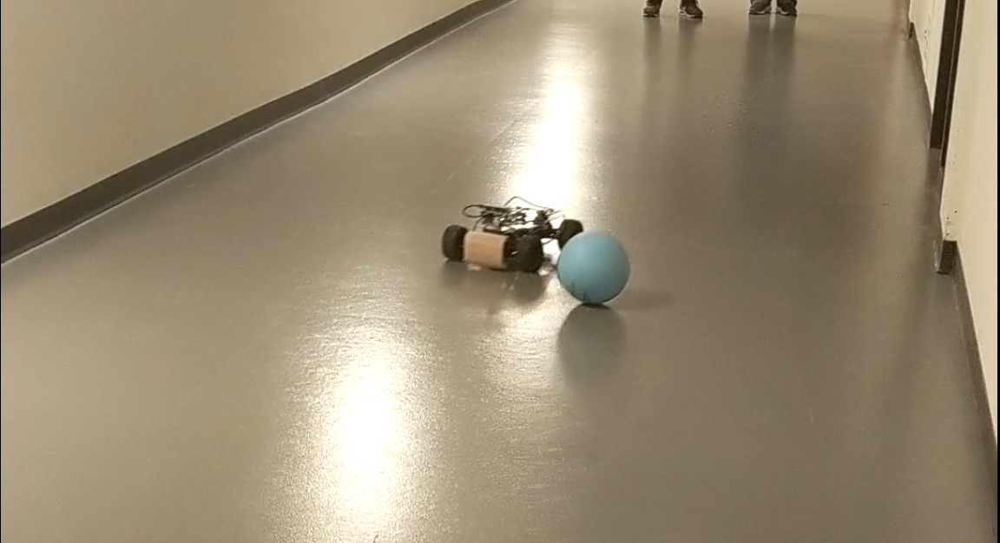

# Self-driving Race Car
An 1/10 autocar project on Advance Robotics class with our team Robotgrandson.

Instructor: Prof. Christoffer Heckman.
Team Member: Chi-Ju Wu, Chi Chen, Zheng Shen, Dongming Chang, Zhengyu Hua.

## Goal:

Realize a self-driving race car which is capable of many different challenges and integrate the hardware and algorithms in perception, motion planning and trajectory generation. 

## Hardware design:

The hardware includes a RealSense camera, a Pololu controller, an on board IMU and a Rock 64 CPU. This system utilizes the depth data of RealSense camera to realize real-time obstacle detection and IMU data to track the status of the race car. We designs a two-stage shelf for all the devices.

Layout of wiring of the race car

The outlook of the race car

## Software design:

To complete this final project, we adopt to develop our programs on ROS (Robotics Operating System). Because of the active community and the rich packages for controlling robots, ROS is the best platform for us. In addition, ROS provides versatile tools such as rosbag, rqt_console, and RViZ. To drive all devices on ROS, we install Ubuntu 18.04 on our Rock64 board and install ROS Melodic as well. Next, we utilize librealsense to integrate RealSense D435i and RapaPololuMaestro to control the Pololu controller to control the motors on the car. Finally, to make sure each part works well, we implement a keyboard control program on ROS. Through this program, we can control motors and receive sensor data. Moreover, this program can be incorporated with rosbag and help us debugging.

## Operation algorithm and race

From the flow chart, you can see we create 6 statuses, which are Stop, Straight, Straight Left (small left turn), Straight Right (small right turn), Turn Right and Turn Left. We also create one node to publish the status, and the other node to subscribe this topic and update the status based on state machine. 

If the subscriber didn’t receive any data, it would get in Stop status. If the subscriber receives the data, the default status would be straight. The straight status will last until the depth of the middle window drop into certain range. Then we will update the status from straight to Turn Left or Turn Right based on the comparison between the left depth and right depth. Afterwards, the Turn Left or Turn Right status will last until the front depth again becomes enough large, then the status would change to Straight. 

Also, during the Straight status, we will check if the difference between the right depth and the left depth is overlarge. If this difference goes beyond a certain threshold, the status would be updated to Straight Left or Straight Right, which means small left turn and small right turn, respectively. 

At the same time, we will keep detect the difference between two sides, and if this value goes down to the threshold we set, we will change the status back to the Straight. This logic is shown more intuitively in the flow chart above.

Finally, we code this logic up and test it in our race car. After we tune several parameters which regarding the motor speed and steering angle, the car can navigate the hallway with a decent speed. The average time for the car to finish the course is below 30s, which we think is a quite good performance. 

For the race part, we need to run several ROS nodes. It would be time-consuming to run all these nodes separately. Therefore, we wrote a launch file, so that we can launch all these nodes at the same time. These nodes all include the Pololu control node, the state machine node, and the RealSense launch file. With this launch file, it would be more convenient to test our race car every time. Also, we use rosbag to record a video of the race car driving the hallway using keyboard control, so that we can test our algorithm on this video instead of running the car every time we changed the code. These are two methods we used during the project, and they are proved to be quite useful and make our work developing more efficiently.

## Depth detection method:

First, we use ROS to control the RealSense D435i to detect the surrounds, and it will publish a topic named ‘/camera/depth/image_rect_raw’ which returns the depth information of the environment. Then we create a subscriber to subscribe the message and convert it to OpenCV image using cv_bridge package in the callback function.  After that, we create three small square windows, located at left, middle and right of the image, then we calculate the mean of the depth value for each square window to represent the distance from the car to the left wall, the front, and the right wall, respectively.

                           

## Challenges:

### Avoid moving obstacles

Autocar should consider pedestrains who might get in the way of car and avoid collision with them or other obstacles.This challenge requires our race car to avoid a rolling ball from about 5 meters away with a speed of 1 meter per second. The time limitation for our race car to react is the main difficulty. To detect the rolling ball better, we adjust and add some detection area in our RealSense camera. The former design of detection areas of camera for speed race positions relatively high. To detect walls and doors which are big enough, we do not need a very board detection area which required more time to process in Rock 64 CPU. In real time, depth data of RealSense camera in higher places is more stable than in lower places because of its detection range limitation. For speed race, we prefer detecting high for a robust race car performance. Nevertheless, for this challenge, we cannot do that since the rolling ball is much smaller than a wall or a door and it is moving. 

   

We test our algorithm for several times, and the car will avoid the ball with 80% ratio of success. Also, we should note that this challenge also depends on the speed and direction of the rolling ball. But overall, our algorithm can handle most situations, and it would fail if the rolling ball is too fast for the car to respond. 

          

A ball rolls to the car      

The car avoid the ball

### Detect stop sign

We also teach our car to detect stop sign, which is essential while driving on the road. We need to make the car recognize the stop sign and stop right before it for about 3 seconds, and then keep driving. 

The stop sign is basically a red circle. Considering there isn’t any other red circles in our race course, we can use these two features for recognition. For circle detection, we can use Circle Hough Transform. Circle Hough Transform is a feature extraction technique for detecting circles. By using this algorithm, we can detect the stop sign in our frame quite easily. After we get the circle, we can randomly select the pixels inside the circle, and check the color of these pixels. If the number of red pixels exceeds the threshold we set, then we determine that the stop sign is show up in our frame. Finally, we will get the depth of the center of the circle from the depth image, and if the depth is less than 2m, we will send a signal to our controller and make the car stop for 3 seconds. After the stop, the car will resume driving and finish the rest of the race course. 

In this challenge, we print out the stop sign and put it at a distance before the car. 

The car is driving along the road  

 

The car stops at sign  

After 3 seconds the car continues driving

Then the car will recognize the stop sign, as long as it detects the stop sign, the car will stop right before the sign for about 3 seconds. Afterwards, the car will continue driving and pass the stop sign. From the following figures, we can find that our algorithm did a quite good job. We test this challenge for several times, and every time the car will stop right before the stop sign, which is quite reliable and robust. 

### Back from collision site

When collision happens in real life, people tend to back up, check and continue drive if there is no damage. Even if we teach the auto car to avoid obstacles, collisions still have a little possibility to happen. We need to teach the auto car how to back up and continue driving in that case.

The basic logic is consistent with what we did in the race part, except that for this challenge, we will add another if condition with the highest priority. If we detect the depth of the center, left, and right of the frame are all less than certain threshold, then it means the car is running across an obstacle. 

   

When collision happens what camera sees.

Then we change the status into ‘Back’ and this status will last until the camera detects the depth of center again becomes enough large, then we will change the status from ‘Back’ to ‘Straight’ and continue the same logic as the race part. Being clear with this logic then we test it in our race car. After several rounds of the parameter tuning, the car can finish this challenge with high reliability and robustness. 

We test our algorithm for several times, and for this challenge, the car will always detect the barrier and accomplish the back motion. 

 

The car runs into a collision 

 

The car starts backing to a certain distance 

The car continues driving

## Results

The implementation of our designed algorithm demonstrates that the race car realizes moving at a fast speed on straight road, the capability of detecting walls or obstacles and reacting the properly before collision. Even collision happens, the implementation also shows the ability of back out from the collision and continue driving normally. The future work includes realization of real-time visual SLAM and improving performance of driving in a relative complex environment. 

## How to import our code:

The IMU package is a subscriber for ROS to get some location info of our auto car, for example the turning angle.
The Image package has the code for RealSense camera depth information. We took some blocks on the image to represent the distance from left, right and straight. This would be used at determine whether the car needs to make a turn and adjust its angle when not going very straight. Codes are in C++ and Python.

More information about how to install ubuntu 16.04 and ROS, you could find here: https://github.com/Wasabi111/HRI_Interruption-/tree/master/openface_ros. Thanks to Chi-Ju Wu and Chi Chen.

Credit to our team.
